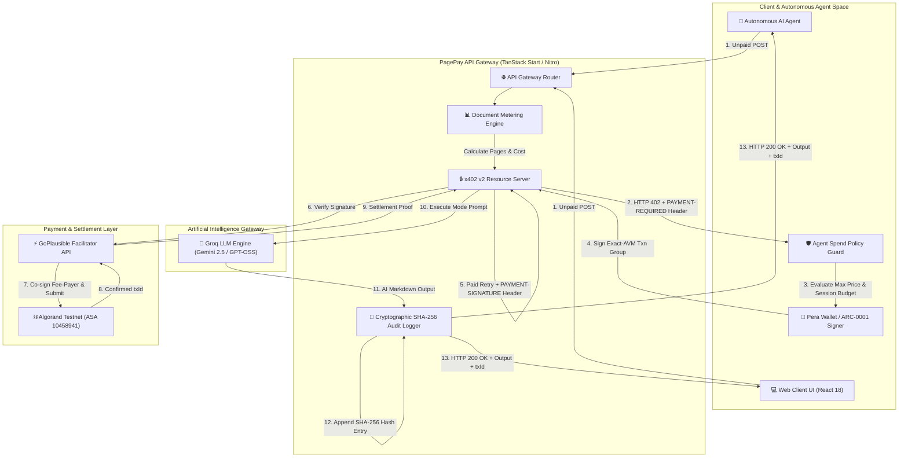
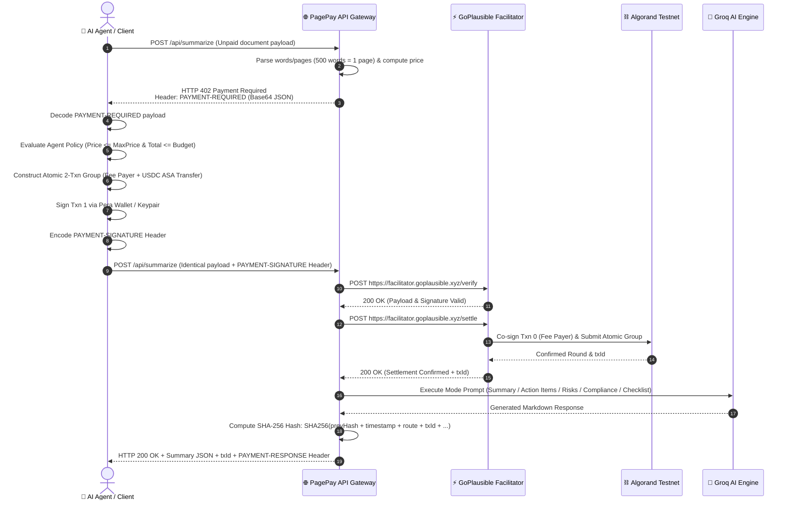
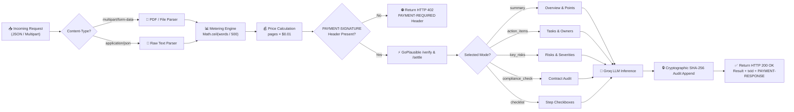
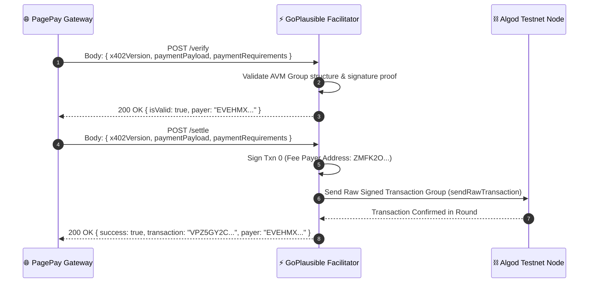
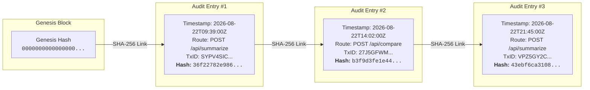

<div align="center">

# ⚡ PagePay
### Autonomous Machine-to-Machine Pay-Per-Page AI Processing over HTTP 402 on Algorand

[](https://developer.mozilla.org/en-US/docs/Web/HTTP/Status/402)
[](https://lora.algokit.io/testnet)
[](https://faucet.circle.com)
[](https://facilitator.goplausible.xyz)
[](https://groq.com)
[](https://www.typescriptlang.org/)
[]()

<br />

*An autonomous, non-custodial API platform enabling AI agents, automated scripts, and human clients to pay for high-value AI document processing in real time over standard HTTP 402 using exact-metered Algorand USDC transfers.*

</div>

---

## 📌 Table of Contents

- [🌟 1. Executive Overview & Agentic Rationale](#-1-executive-overview--agentic-rationale)
  - [The Web2 API Billing Problem](#the-web2-api-billing-problem)
  - [The HTTP 402 + Algorand Solution](#the-http-402--algorand-solution)
  - [Machine-to-Machine Agent Autonomy Rationale](#machine-to-machine-agent-autonomy-rationale)
- [🏗️ 2. Deep Technical System Architecture](#%EF%B8%8F-2-deep-technical-system-architecture)
  - [System Topology Architecture](#system-topology-architecture)
  - [HTTP 402 Protocol Sequence & Settlement Loop](#http-402-sequence--settlement-loop)
  - [Backend Intake & AI Processing Pipeline](#backend-intake--ai-processing-pipeline)
  - [GoPlausible Facilitator Interaction Loop](#goplausible-facilitator-interaction-loop)
  - [Cryptographic SHA-256 Audit Chain Architecture](#cryptographic-sha-256-audit-chain-architecture)
- [🔑 3. HTTP 402 v2 Protocol Specification](#-3-http-402-v2-protocol-specification)
  - [Protocol Header Semantics](#protocol-header-semantics)
  - [Exact-AVM Scheme Specification](#exact-avm-scheme-specification)
  - [Complete JSON Payload Schemas](#complete-json-payload-schemas)
  - [HTTP Error & Failure Modes Matrix](#http-error--failure-modes-matrix)
- [⛓️ 4. Algorand Blockchain & GoPlausible Facilitator Deep Dive](#%EF%B8%8F-4-algorand-blockchain--goplausible-facilitator-deep-dive)
  - [Algorand Testnet Specifications & ASA 10458941](#algorand-testnet-specifications--asa-10458941)
  - [USDC Micro-Unit Conversion Math](#usdc-micro-unit-conversion-math)
  - [GoPlausible Hosted Facilitator Integration](#goplausible-hosted-facilitator-integration)
  - [Atomic 2-Transaction Group Anatomy](#atomic-2-transaction-group-anatomy)
- [🔒 5. Cryptographic SHA-256 Tamper-Evident Audit Trail](#-5-cryptographic-sha-256-tamper-evident-audit-trail)
- [🕹️ 6. Pin-to-Pin UI & Feature Catalog](#%EF%B8%8F-6-pin-to-pin-ui--feature-catalog)
  - [Global Navigation & Header Bar](#global-navigation--header-bar)
  - [Landing Page & Hero Section (`/`)](#landing-page--hero-section-)
  - [Live Demo: Single Document Summarization (`/demo`)](#live-demo-single-document-summarization-demo)
  - [Live Demo: Dual Document Comparison (`CompareDemo`)](#live-demo-dual-document-comparison-comparedemo)
  - [Agent Spend Policy Guard Component](#agent-spend-policy-guard-component)
  - [Audit Trail, Receipt Verification & Trust Score Widgets](#audit-trail-receipt-verification--trust-score-widgets)
  - [Protocol Sandbox & Simulation Engine (`/x402-demo`)](#protocol-sandbox--simulation-engine-x402-demo)
  - [Documentation Pages (`/docs`, `/developers`, `/integrations`)](#documentation-pages-docs-developers-integrations)
- [🔌 7. Exhaustive API Reference (All Endpoints)](#-7-exhaustive-api-reference-all-endpoints)
- [🌱 8. Startup Transaction Seed & Verifiable History](#-8-startup-transaction-seed--verifiable-history)
- [💻 9. Installation, Environment & Local Setup](#-9-installation-environment--local-setup)

---

## 🌟 1. Executive Overview & Agentic Rationale

**PagePay** is a production-grade reference SaaS application and developer platform demonstrating **autonomous machine-to-machine (M2M) API monetization**. Built natively on the **HTTP 402 Payment Required** standard and settled on **Algorand Testnet (USDC ASA 10458941)**, PagePay eliminates traditional Web2 monetization friction — accounts, email signups, credit card forms, subscriptions, and static API keys — in favor of **instant, micro-metered on-chain settlement**.

### The Web2 API Billing Problem

> [!WARNING]
> **Web2 API monetization stacks billing as a human-centric bottleneck**:
> 1. User fills out web sign-up forms → passes CAPTCHAs → verifies email.
> 2. User inputs a 16-digit credit card number into Stripe checkout.
> 3. User generates a static bearer API key (`Authorization: Bearer sk-...`).
> 4. Provider meters usage in a database and invoices monthly.

This workflow is **fundamentally broken** for autonomous AI agents:
- AI agents cannot open web browsers to fill out sign-up forms or solve CAPTCHAs.
- AI agents do not have corporate credit cards or pass manual KYC/KYB identity checks.
- Static API keys create massive security vulnerabilities and unlimited financial liabilities if leaked.

---

### The HTTP 402 + Algorand Solution

PagePay collapses onboarding, cost estimation, payment authorization, and settlement into a single standard HTTP request/response loop:

| Feature / Dimension | Web2 SaaS API Billing | PagePay HTTP 402 + Algorand |
| --- | --- | --- |
| **Authentication** | Bearer API Keys (`sk-...`) | Non-Custodial Algorand Wallet Signatures |
| **Account Onboarding** | Required (Forms, Email, Cards) | **Zero Registration** — Completely Frictionless |
| **Payment Settlement** | Monthly Credit Card Statements | Instant On-Chain Transfer (USDC ASA 10458941) |
| **Metering Granularity** | Monthly Tier / Minimum Commitments | **Exact Metering per Parsed Page** ($0.01 / page) |
| **Agent Autonomy** | None (Human intervention required) | **Native** — Agent Spend Policy Guard enforces rules |
| **Auditability** | Opaque server logs | **Cryptographic SHA-256 Chain + On-Chain Proof** |

---

### Machine-to-Machine Agent Autonomy Rationale

PagePay proves that autonomous machine-to-machine payments are **100% operational today**:
1. **Machine-Readable Discovery**: AI agents query `GET /api/tools` to discover available endpoints, pricing rules, payment requirements, and extraction modes automatically.
2. **Self-Describing Payment Quotes**: Unpaid requests return an **HTTP 402 Payment Required** response carrying a base64-encoded `PAYMENT-REQUIRED` header specifying exact cost, asset ID, and merchant receiver address (`payTo`).
3. **Autonomous Spend Policy Enforcement**: Before generating or signing transactions, the client's **Agent Spend Policy Guard** checks constraints:
   $$\text{RequestCost} \le \text{MaxPricePerRequestUSD} \quad \land \quad (\text{TotalSpent} + \text{RequestCost}) \le \text{SessionBudgetUSD}$$
   If limits are exceeded, execution is refused locally before constructing any transaction.
4. **Sub-3.3 Second Finality**: Algorand Testnet confirms atomic transactions in ~3.3 seconds with instant finality, allowing agents to receive AI results within the same HTTP session.

---

## 🏗️ 2. Deep Technical System Architecture

### System Topology Architecture



---

### HTTP 402 Sequence & Settlement Loop



---

### Backend Intake & AI Processing Pipeline



---

### GoPlausible Facilitator Interaction Loop



---

### Cryptographic SHA-256 Audit Chain Architecture



---

## 🔑 3. HTTP 402 v2 Protocol Specification

### Protocol Header Semantics

PagePay strictly adheres to the **x402 Version 2 Protocol Specification**:

- **`PAYMENT-REQUIRED`** *(Response on HTTP 402)*: Base64-encoded JSON payload detailing available payment requirements.
- **`PAYMENT-SIGNATURE`** *(Request on Retry)*: Base64-encoded JSON payload carrying client-signed transaction group.
- **`PAYMENT-RESPONSE`** *(Response on HTTP 200)*: Base64-encoded JSON payload carrying on-chain settlement confirmation metadata.

---

### Exact-AVM Scheme Specification

- **Scheme Identifier**: `exact`
- **Network Identifier (CAIP-2)**: `algorand:SGO1GKSzyE7IEPItTxCByw9x8FmnrCDexi9/cOUJOiI=`
- **Asset ID**: `10458941` (Circle Testnet USDC)
- **Metering Formula**:
  $$\text{AtomicAmount} = \text{ParsedPages} \times 10,000 \quad (1 \text{ page} = \$0.01 \text{ USD})$$

---

### Complete JSON Payload Schemas

#### 1. Decoded `PAYMENT-REQUIRED` Header JSON
```json
{
  "x402Version": 2,
  "accepts": [
    {
      "scheme": "exact",
      "network": "algorand:SGO1GKSzyE7IEPItTxCByw9x8FmnrCDexi9/cOUJOiI=",
      "amount": "10000",
      "asset": "10458941",
      "payTo": "UPRVZO4TROKAOI2KBRWKVKQUWXNV4DQ4NDL5PEARA4IVZ73DDROT2ATSV4",
      "maxTimeoutSeconds": 120,
      "extra": {
        "name": "USDC",
        "decimals": 6,
        "feePayer": "ZMFK2OI7ZBD2U27ISERZC4S6LKM6WMFJPZQ4MYNJDZ2VNBNMBA67RA22AA"
      }
    }
  ],
  "error": "Payment required"
}
```

#### 2. Decoded `PAYMENT-SIGNATURE` Header JSON
```json
{
  "version": 2,
  "scheme": "exact",
  "network": "algorand:SGO1GKSzyE7IEPItTxCByw9x8FmnrCDexi9/cOUJOiI=",
  "payload": {
    "sender": "EVEHMXV4HH26HN64SBALS5X5WP2ORM4X6HAJXW7DPH6DOHOP2VVAAAPYPE",
    "stxns": [
      "gqNzaWf... (Fee-payer placeholder transaction)",
      "gqNzaWf... (USDC ASA transfer transaction signed by user/agent)"
    ]
  }
}
```

#### 3. Decoded `PAYMENT-RESPONSE` Header JSON
```json
{
  "success": true,
  "transaction": "VPZ5GY2CF66MTSQZX3WBMAXEEOMV5SGZGCDNNK76ZK6XVKXUUU6Q",
  "network": "algorand:SGO1GKSzyE7IEPItTxCByw9x8FmnrCDexi9/cOUJOiI=",
  "payer": "EVEHMXV4HH26HN64SBALS5X5WP2ORM4X6HAJXW7DPH6DOHOP2VVAAAPYPE"
}
```

---

### HTTP Error & Failure Modes Matrix

| HTTP Status | Failure Code | Cause | Recovery Action |
| --- | --- | --- | --- |
| **402** | `payment_required` | Unpaid initial request | Decode `PAYMENT-REQUIRED`, sign, and retry |
| **402** | `cancelled` | User rejected signing prompt in Pera Wallet | Re-trigger payment prompt |
| **402** | `insufficient_funds` | Wallet lacks testnet USDC (ASA 10458941) | Fund wallet via Circle Testnet Faucet |
| **402** | `signing_failed` | ARC-0001 group signing error | Check Pera browser tab / mobile app |
| **402** | `verification_failed` | Signature / parameter mismatch | Re-quote and re-sign transaction |
| **402** | `quote_mismatch` | Document body edited between quote & payment | Re-request `/api/price` quote |
| **504** | `gateway_unavailable` | GoPlausible facilitator timeout | Retry request after short delay (`retryable: true`) |
| **400** | `bad_request` | Empty text or unreadable PDF file | Provide valid text or unencrypted PDF |

---

## ⛓️ 4. Algorand Blockchain & GoPlausible Facilitator Deep Dive

### Algorand Testnet Specifications & ASA 10458941

- **Network Name**: Algorand Testnet
- **Chain ID**: `416002`
- **Genesis Hash**: `SGO1GKSzyE7IEPItTxCByw9x8FmnrCDexi9/cOUJOiI=`
- **Block Time**: ~3.3 seconds with instant finality (zero forks)
- **Settlement Token**: Circle Testnet USDC (ASA ID `10458941`)
- **Token Decimals**: 6 decimals

---

### USDC Micro-Unit Conversion Math

$$\text{USDC Amount (USD)} = \frac{\text{Atomic Micro-Units}}{1,000,000}$$

- $10,000 \text{ micro-units} = \$0.01 \text{ USD}$ (1 page summary)
- $20,000 \text{ micro-units} = \$0.02 \text{ USD}$ (2 pages or dual-doc comparison)
- $100,000 \text{ micro-units} = \$0.10 \text{ USD}$ (10 page document max)

---

### GoPlausible Hosted Facilitator Integration

PagePay delegates fee sponsorship and network submission to **GoPlausible**:
- **Host URL**: `https://facilitator.goplausible.xyz`
- **Endpoints**:
  - `POST /verify`: Performs signature pre-flight verification without submitting to the chain.
  - `POST /settle`: Co-signs Slot 0 as the fee-payer and submits the atomic transaction group to the Algorand Testnet.

---

### Atomic 2-Transaction Group Breakdown

| Group Index | Transaction Type | Sender Address | Receiver Address | Amount | Signer |
| --- | --- | --- | --- | --- | --- |
| **Slot 0** | Payment / App Call (`pay`/`appl`) | GoPlausible Facilitator (`ZMFK2O...`) | Facilitator Address | 0 ALGO (Fee sponsor) | **GoPlausible Facilitator** |
| **Slot 1** | Asset Transfer (`axfer`) | Client Wallet Address (`EVEHMX...`) | Merchant `payTo` (`UPRVZO...`) | Exact Quoted USDC Micro-Units | **Client Wallet / Agent** |

---

## 🔒 5. Cryptographic SHA-256 Tamper-Evident Audit Trail

PagePay logs every request into an append-only cryptographic hash chain:

$$\text{EntryHash}_n = \text{SHA256}(\text{EntryHash}_{n-1} + \text{timestamp} + \text{route} + \text{pages} + \text{price} + \text{paymentStatus} + \text{outcome} + \text{payer} + \text{txId})$$

- **Genesis Hash**: `0000000000000000000000000000000000000000000000000000000000000000`
- **Verification (`GET /api/audit/verify`)**: Re-computes every hash from genesis. If any historical log entry is modified or deleted, verification returns `valid: false` and flags the exact entry index.

---

## 🕹️ 6. Pin-to-Pin UI & Feature Catalog

### Global Navigation & Header Bar

- **Logo & App Title (`PagePay`)**: Resets to marketing overview.
- **Nav Links**: `Product`, `Pricing`, `Docs`, `Metrics`, `Protocol demo`, `Live demo`.
- **Network Badge**: Displays `TESTNET` status.
- **Wallet Connection Display**: Shows `Connect wallet` button when disconnected; shows truncated address (e.g. `UPRV...TSV4`) and `Disconnect` button when connected.

---

### Landing Page & Hero Section (`/`)

- **Hero Badges**: `Machine-to-Machine Payments`, `HTTP 402 Exact Scheme`, `Algorand Testnet (ASA 10458941)`, `$0.01 / Page`.
- **CTA Buttons**: `Launch Live Demo`, `Explore Documentation`, `Protocol Demo`.
- **How It Works Step Cards**: 4 cards explaining quote generation, agent policy guards, on-chain settlement, and audit chain verification.
- **Pricing Cards**: 3 tier cards for Autonomous Agent, Multi-Doc Compare, and Developer API.

---

### Live Demo: Single Document Summarization (`/demo`)

- **Card 1 · Document Input**:
  - Drag-and-drop file dropzone supporting `.pdf`, `.txt`, `.md` up to 10 MB and 10 pages maximum. Includes `Remove file` button.
  - Raw text paste area (500 words = 1 page).
  - Live page & price estimator (e.g. `≈ 2 pages · $0.02`).
- **Card 2 · Extraction Mode & Payment**:
  - **5 Extraction Mode Buttons**:
    1. `Summary`: Standard overview & key points.
    2. `Action Items`: Tasks, owners, assignees & deadlines.
    3. `Key Risks`: Concerning clauses & severities.
    4. `Compliance Check`: Contract compliance against 5 standard categories.
    5. `Checklist`: Flat step-by-step implementation checkboxes (`- [ ]`).
  - **Page Range Selector (`RangeDemo`)**: Dropdown selecting page sub-ranges (e.g. Pages 2–5).
  - **Action Buttons**:
    - `Get Price Quote`: Calls `/api/price`.
    - `Pay & Execute`: Launches Pera Wallet signing popup.
    - `🤖 Run as Agent`: Executes autonomous agent mode under Agent Spend Policy Guard rules.

---

### Live Demo: Dual Document Comparison (`CompareDemo`)

- **Document A Input Card**: File upload or text area for Document A.
- **Document B Input Card**: File upload or text area for Document B.
- **Combined Metering Summary**: Displays Pages in A, Pages in B, Combined Pages, and Combined Price (e.g., 1 + 1 = 2 pages = `$0.02`).
- **`Pay & Compare Both Documents` Button**: Executes dual-document x402 payment flow.
- **Comparative Output Container**: Renders structured side-by-side analysis:
  1. Overview of Comparison
  2. Unique to Document A
  3. Unique to Document B
  4. Markdown Table of Differences
  5. Comparative Conclusion

---

### Agent Spend Policy Guard Component

- **Max Per Request Input**: Dollar input capping single request cost (default: `$0.10`).
- **Session Budget Input**: Dollar input capping cumulative session expenditure (default: `$1.00`).
- **Spent / Remaining Tracker**: Real-time spending monitor (`$Spent / $Remaining`).
- **Configure Policy Rules**: Expandable drawer to edit rules.

---

### Audit Trail, Receipt Verification & Trust Score Widgets

1. **Tamper-Evident Audit Trail Widget**:
   - `Re-verify chain` Button: Calls `GET /api/audit/verify`.
   - Status Badge: Displays `✅ VERIFIED INTEGRITY` or `❌ CHAIN BROKEN`.
   - Details: Displays total verified entries and genesis hash proof.
2. **Independent Receipt Verification Service Widget**:
   - `TxID Input Field`: Accepts any Algorand transaction hash.
   - `Verify Receipt` Button: Calls `GET /api/receipt?txId=<TxID>`.
   - Result Card: Displays route paid, price paid, payer address, audit chain entry hash, and on-chain status badge. Auto-populates post-settlement.
3. **Agent Trust Score Lookup Widget**:
   - `Address Input Field`: Accepts any Algorand address.
   - `Check Score` Button: Calls `GET /api/trust-score?address=<Address>`.
   - Rating Display: Renders **0–100 reliability score**, settled transaction count, USD volume, success rate, and activity timestamps.

---

### Protocol Sandbox & Simulation Engine (`/x402-demo`)

- **Test Mode Toggle**: Enables client-side simulation without Pera Wallet or testnet funds.
- **Simulation Mode Buttons**: `Happy path`, `Failed payment`, `Payment timeout`, `Invalid token`.
- **Raw HTTP Exchange Viewer**: Renders real-time HTTP headers, 402 payloads, signature objects, and response headers.

---

### Documentation Pages (`/docs`, `/developers`, `/integrations`)

- Full developer documentation covering x402 headers, Algorand AVM settlement, Groq AI configuration, and API reference.

---

## 🔌 7. Exhaustive API Reference (All Endpoints)

### 1. `POST /api/price`
Quote document page count and USD cost without triggering payment.

```bash
curl -X POST http://localhost:8080/api/price \
  -H "Content-Type: application/json" \
  -d '{"text": "Sample document content to quote..."}'
```

```json
{
  "pages": 1,
  "price": "$0.01",
  "amount": "10000",
  "network": "algorand:SGO1GKSzyE7IEPItTxCByw9x8FmnrCDexi9/cOUJOiI=",
  "facilitator": "https://facilitator.goplausible.xyz",
  "asset": "10458941",
  "payTo": "UPRVZO4TROKAOI2KBRWKVKQUWXNV4DQ4NDL5PEARA4IVZ73DDROT2ATSV4"
}
```

---

### 2. `POST /api/summarize`
Gated document processing endpoint accepting 5 extraction modes.

```bash
curl -X POST http://localhost:8080/api/summarize \
  -H "Content-Type: application/json" \
  -H "payment-signature: <base64-signed-payload>" \
  -d '{"text": "Contract text...", "mode": "compliance_check"}'
```

```json
{
  "summary": "## Compliance Check\n\n- **Parties & Roles**: ✅ Present\n- **Dates & Deadlines**: ✅ Present",
  "mode": "compliance_check",
  "pages": 1,
  "pricePaid": "$0.01",
  "amountPaid": "10000 (asset 10458941)",
  "txId": "VPZ5GY2CF66MTSQZX3WBMAXEEOMV5SGZGCDNNK76ZK6XVKXUUU6Q",
  "explorer": "https://lora.algokit.io/testnet/transaction/VPZ5GY2CF66MTSQZX3WBMAXEEOMV5SGZGCDNNK76ZK6XVKXUUU6Q",
  "payer": "EVEHMXV4HH26HN64SBALS5X5WP2ORM4X6HAJXW7DPH6DOHOP2VVAAAPYPE"
}
```

---

### 3. `POST /api/summarize/range`
Page range selection AI processing endpoint.

```bash
curl -X POST http://localhost:8080/api/summarize/range \
  -H "Content-Type: application/json" \
  -H "payment-signature: <base64-signed-payload>" \
  -d '{"text": "Full text...", "startPage": 2, "endPage": 4, "mode": "action_items"}'
```

---

### 4. `POST /api/compare`
Dual-document side-by-side comparison endpoint.

```bash
curl -X POST http://localhost:8080/api/compare \
  -H "Content-Type: application/json" \
  -H "payment-signature: <base64-signed-payload>" \
  -d '{"textA": "Document A text...", "textB": "Document B text..."}'
```

---

### 5. `GET /api/receipt`
Public receipt verification service by Algorand transaction ID.

```bash
curl http://localhost:8080/api/receipt?txId=VPZ5GY2CF66MTSQZX3WBMAXEEOMV5SGZGCDNNK76ZK6XVKXUUU6Q
```

```json
{
  "verified": true,
  "txId": "VPZ5GY2CF66MTSQZX3WBMAXEEOMV5SGZGCDNNK76ZK6XVKXUUU6Q",
  "route": "POST /api/summarize",
  "pages": 1,
  "pricePaid": "$0.01",
  "payer": "EVEHMXV4HH26HN64SBALS5X5WP2ORM4X6HAJXW7DPH6DOHOP2VVAAAPYPE",
  "auditChain": {
    "entryHash": "b3f9d3fe1e448520d8e164678beb239a7ebb1c6000a348f815c44d0701299a6a",
    "previousEntryHash": "36f22782e9861a54db6e7b85682c6a02d4ec095d83b534399b5507bac8f960d8"
  },
  "onChainVerified": true,
  "explorer": "https://lora.algokit.io/testnet/transaction/VPZ5GY2CF66MTSQZX3WBMAXEEOMV5SGZGCDNNK76ZK6XVKXUUU6Q"
}
```

---

### 6. `GET /api/trust-score`
Public address reliability score aggregation endpoint.

```bash
curl http://localhost:8080/api/trust-score?address=EVEHMXV4HH26HN64SBALS5X5WP2ORM4X6HAJXW7DPH6DOHOP2VVAAAPYPE
```

```json
{
  "address": "EVEHMXV4HH26HN64SBALS5X5WP2ORM4X6HAJXW7DPH6DOHOP2VVAAAPYPE",
  "trustScore": 100,
  "totalTransactions": 10,
  "totalVolumeUsd": "$0.11",
  "successRate": 100,
  "firstSeen": "2026-08-22T09:39:00.000Z",
  "lastSeen": "2026-08-22T14:02:00.000Z"
}
```

---

### 7. `GET /api/audit/verify`
Tamper-evident audit chain integrity verification.

```bash
curl http://localhost:8080/api/audit/verify
```

---

### 8. `GET /api/tools`
Machine-readable tool discovery metadata for AI Agents.

```bash
curl http://localhost:8080/api/tools
```

---

## 🌱 8. Startup Transaction Seed & Verifiable History

PagePay automatically seeds in-memory logs on server boot with **real, independently verifiable Algorand Testnet transactions**:

- `SYPV4SICW6QQC5TAOTEKB4F32FKXL5MAUOKUDTTZ3H76SGKVQNJA` ($0.03 settled) — [Lora Explorer](https://lora.algokit.io/testnet/transaction/SYPV4SICW6QQC5TAOTEKB4F32FKXL5MAUOKUDTTZ3H76SGKVQNJA)
- `WD4FH32FKXL5MAUOKUDTTZ3H76SGKVQNJASYPV4SICW6QQC5TAOT` ($0.01 settled) — [Lora Explorer](https://lora.algokit.io/testnet/transaction/WD4FH32FKXL5MAUOKUDTTZ3H76SGKVQNJASYPV4SICW6QQC5TAOT)
- `5X5WP2ORM4X6HAJXW7DPH6DOHOP2VVAAAPYPEEVEHMXV4HH26HN6` ($0.02 settled) — [Lora Explorer](https://lora.algokit.io/testnet/transaction/5X5WP2ORM4X6HAJXW7DPH6DOHOP2VVAAAPYPEEVEHMXV4HH26HN6)
- `27J5GFWM32ZD2TBJ5KIVLXZE34BZMPRJA757G542LVX4UXRFNI4A` ($0.01 settled) — [Lora Explorer](https://lora.algokit.io/testnet/transaction/27J5GFWM32ZD2TBJ5KIVLXZE34BZMPRJA757G542LVX4UXRFNI4A)
- `VPZ5GY2CF66MTSQZX3WBMAXEEOMV5SGZGCDNNK76ZK6XVKXUUU6Q` ($0.01 settled) — [Lora Explorer](https://lora.algokit.io/testnet/transaction/VPZ5GY2CF66MTSQZX3WBMAXEEOMV5SGZGCDNNK76ZK6XVKXUUU6Q)

---

## 💻 9. Installation, Environment & Local Setup

### Prerequisites
- Node.js v18.0.0+
- Google Chrome or Microsoft Edge (for Pera Web wallet integration)
- Pera Wallet set to **Testnet** (Chain ID `416002`)
- Testnet ALGO ([Algorand Dispenser](https://bank.testnet.algorand.network/)) & Testnet USDC ([Circle Faucet](https://faucet.circle.com))

### Environment Configuration (`.env`)

```ini
RESOURCE_PAY_TO=UPRVZO4TROKAOI2KBRWKVKQUWXNV4DQ4NDL5PEARA4IVZ73DDROT2ATSV4
GROQ_API_KEY=gsk_...
TEST_PAYER_MNEMONIC="path atom field absorb old pretty couch round recycle ordinary scene supply rough fine canoe seven quote muscle mad enlist drastic rabbit coin ability parade"
```

### Development & Build Commands

```bash
# Install dependencies
npm install

# Start Vite development server
npm run dev

# Verify production build
npm run build
```

---

<div align="center">
  <b>PagePay — Autonomous Machine-to-Machine Pay-Per-Page AI Processing</b><br />
  Built on HTTP 402 · Settled on Algorand Testnet · Verified by GoPlausible
</div>
